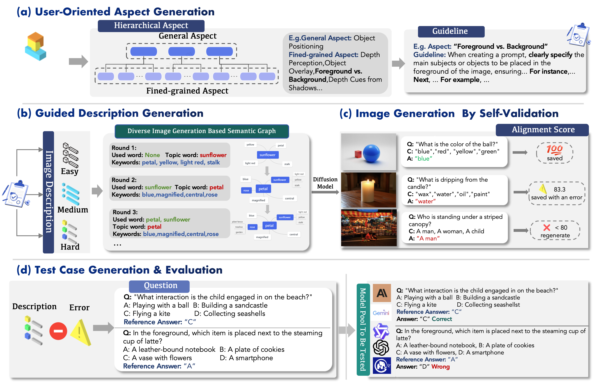

# AutoBench-V: Can Large Vision-Language Models Benchmark Themselves?

## Framework Overview

<div align="center">

<div align="center">

<p align="center">
  <a href="https://arxiv.org/abs/">
    
  </a>
  <a href="https://autobench-v.github.io/">
    
  </a>
  <a href="https://github.com/wad3birch/AutoBench-V/issues">
    
  </a>
  <a href="https://github.com/wad3birch/AutoBench-V">
    
  </a>
</p>



## File Structure

```bash
.
├── README.md
├── config
├── document
├── figure
├── process
├── requirements.txt
├── run_script.sh
└── tools
```

`config`: Including prompt to use and parameters to set, etc.

`document`: model's final performance, examiner priority, and position bias.

`figure`: figures used in paper

`process`: code of AutoBench-V

`tools`: Some common tools, such as image base64 conversion, data visualization and so on.

`run_script.sh`: api to use.

## Usage

```bash
pip -r install requirements.txt
./run_script.sh
python pipeline.py
```

Remember to change parameters: `user_input` and `generate_type` when run `pipeline.py`.

five options for `user_input`:

- `basic_understanding`
- `spatial_understanding`
- `semantic_understanding`
- `reasoning_capacity`
- `atmosphere_understanding`


For a complete pipeline, you only need to use 7 kinds for `generate_type` in order:

- `aspect`: generate aspects
- `guideline` : generate guidelines
- `prompts`: generate image descriptions 
- `images`: generate images based on description 
- `alignment`: test the alignment of images and descriptions via VQA
- `questions`: generate questions to test LVLMs
- `answers`: answer questions and score
